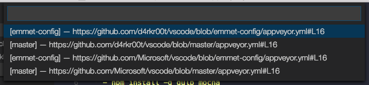

# Open in GitHub

[](https://github.com/d4rkr00t/vscode-open-in-github/issues)
[](http://commitizen.github.io/cz-cl)

Provides commands to quickly view the current file on GitHub.

## Installation
Launch VS Code Quick Open (⌘+P), paste the following command, and type enter.
```
ext install vscode-open-in-github
```


## Usage
When editing a file, use the command palette (cmd + shift + p / ctrl + shift + p) to:

* Open the file in GitHub — "Open In GitHub: File"




## Features

* Supports multiple remotes and branches.
* Supports in-house GitHub installations.
* Should work fine with other providers like Bitbucket etc.
* Configurable default branch.

## Configuration

Add these lines to the workspace settings:

```js
{
  ...
  "openInGitHub.defaultBranch": "dev", // Set default branch, default: master
  ...
}
```

## TODO
* Open File Blame
* Open File History
* Open Repository
* Open Pull Request related to the file

## Links

Logo taken from here: [https://octodex.github.com/](https://octodex.github.com/)
